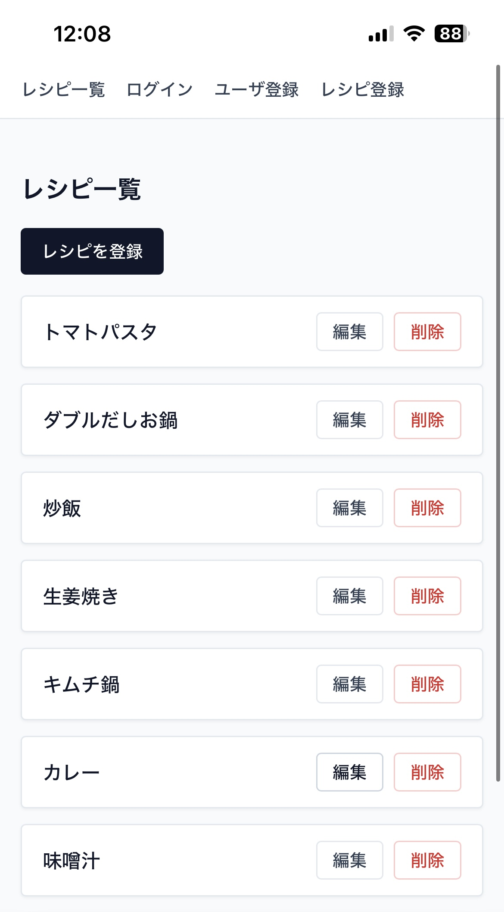
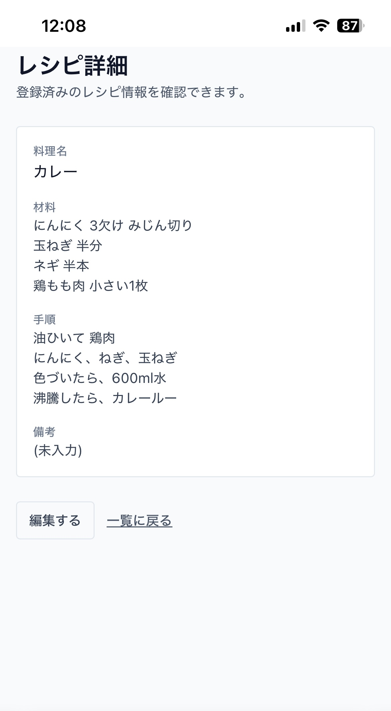
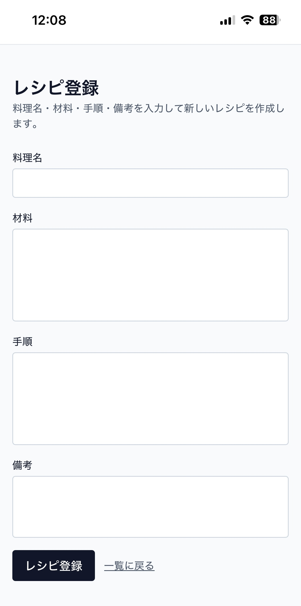

# 料理レシピ管理アプリ

## 1. アプリの目的
日々の料理レシピを記録しようとしても、メモアプリやSNS投稿では整理が難しく、検索や再利用に手間がかかっていました。本アプリは、家庭で共有できるレシピデータベースを構築し、必要なレシピを素早く取り出せるようにすることを目的としています。まだ検索機能やタグ付け機能はありませんが、今後追加予定です。

## 2. 主な機能

ログインしてレシピ管理機能を利用できます。

  

メールアドレスとパスワードによる認証を行い、招待制のユーザーのみがアプリを利用できます。セッション管理はHTTPOnlyクッキーで安全に保持します。

トップ画面では登録済みレシピの一覧が確認できます。

  

レシピカードはタイトルと主要な材料を表示し、クリックすると詳細画面へ遷移します。検索性と視認性を高めるため、カードレイアウトとフィルタ機能を組み合わせています。

個別レシピ画面で詳細を閲覧できます。

  

タイトル・材料・作り方・メモを整理して表示し、ステップごとに視線誘導しやすい構成にしています。調理中でも読みやすいよう余白と文字サイズを最適化しています。

新しいレシピを登録できます。

  

フォームでは材料や手順をセクション別に入力でき、プレビューとバリデーションで入力ミスを軽減します。登録後は即座に一覧へ反映され、同一セッション内で編集・削除も可能です。

## 3. 技術スタック

| カテゴリ | 使用技術・サービス |
| --- | --- |
| フロントエンド | React / TypeScript / Vite / Tailwind CSS |
| バックエンド | Flask / Python |
| データベース | SQLite |
| テスト | Pytest / React Testing Library |
| 開発環境 | Node.js / npm / pip / venv |
| デプロイ / CI構成 | PythonAnywhere / GitHub Actions（CI/CD設定は公開リポジトリから除外） |
